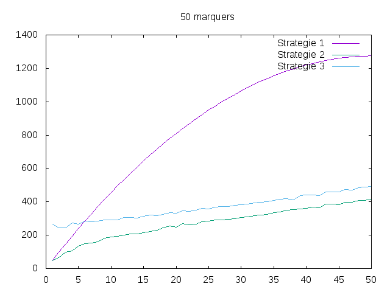
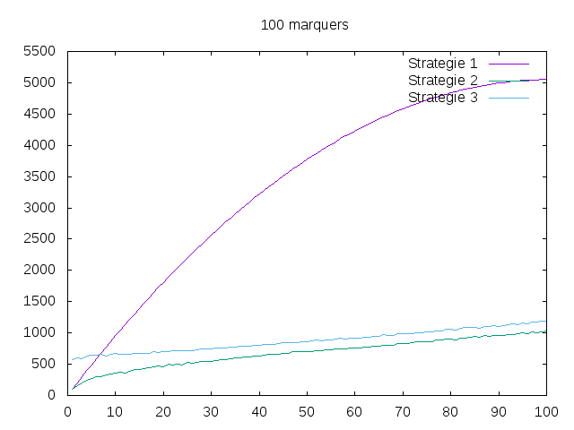

---------------
Experimentateur
---------------

.. toctree::
   :maxdepth: 1

   experience.rst
   sorting.rst

~~~~~~~~~~
Etat du TP
~~~~~~~~~~

Le TP a été effectué en entier.

~~~~~~~~~~~~~~~~~~~~~~
Réponses aux questions
~~~~~~~~~~~~~~~~~~~~~~

~~~~~~~~~~~
Stratégie 1
~~~~~~~~~~~

Question 1.1
--------------

Le travail a bien été préparé.

Question 1.2.1
--------------

.. autofunction:: test.negative_markers1

Question 1.2.2
--------------

L'opération que nous devons compter est la comparaison d'un marqueur à l'un des marqueurs positifs, c'est à dire la fonction suivante (j est un nombre permettant de parcourir la liste des marqueurs positifs) :

.. code-block:: python

   compare(marker, positive[j]) == 0

Question 1.2.3
--------------

Soit `m` le nombre de marqueurs au total et `p` le nombre de marqueurs positifs.
On considère que la liste des marqueurs positifs est inclus dans la liste des marqueurs.

Notre algorithme parcourt pour chaque marqueur la liste des marqueurs positifs à l'aide d'une boucle ``while``.

Il n'existe donc pas de pire cas de notre algorithme car quoiqu'il arrive, on examine **chaque** marqueur.
De plus, le nombre de comparaisons pour les marqueurs positifs ne varie que selon la taille de *p*.

Question 1.2.4
--------------

Avec le raisonnement de la question précédente, on obtient la formule:

.. math::

  c_{1}(m,p) = (m-p)\times p + \sum\limits_{i=1}^p i = (m-p)\times p + \frac{p(p+1)}{2}

~~~~~~~~~~~
Stratégie 2
~~~~~~~~~~~

Question 1.3.1
--------------

.. autofunction:: test.negative_markers2

Question 1.3.2
--------------

Soit `m` le nombre de marqueurs au total et `p` le nombre de marqueurs positifs.
On considère que la liste des marqueurs positifs est inclus dans la liste des marqueurs.

La boucle ``for marker in markers`` effectue `m` itérations. A chaque iteration, le programme effectue une recherche dichotomique (qui a une complexité en
:math:`\log_{2} p`), la borne supérieure de l'algorithme est :

.. math::

  m\times \log_{2} p.

**Remarque**: Il faut également compter le nombre d'opérations effectuées par le ``merge_sort`` pour trier la liste des `markers` positifs.

~~~~~~~~~~~
Stratégie 3
~~~~~~~~~~~

Question 1.4.1
--------------

.. autofunction:: test.negative_markers3

Question 1.4.2
--------------

Soit `m` le nombre de marqueurs au total et `p` le nombre de marqueurs positifs.
On considère que la liste des marqueurs positifs est inclus dans la liste des marqueurs.

Nous obtenons le pire des cas quand il n'y a aucun marqueur negatif, c'est à dire que `m = p` (car la liste des marqueurs positifs est inclus dans la liste des marqueurs). Dans ce cas l'algorithme fait `m` comparaisons.

La borne supérieure est donc:

.. math::
  m

**Remarque**: Pour cette strategie il faut également compter le nombre d'opérations effectuées par le ``merge_sort`` pour trier la liste des `markers` positifs et de tout les `markers`.
En raison des deux ``merge_sort`` effectués sur les 2 listes de marqueurs, on obtient une complexité en :math:`m\times \log_{2} p`

~~~~~~~~~~~~~~~~~~~~~~~~~~~~~~~~~~~~~~
Recherche empirique des cas favorables
~~~~~~~~~~~~~~~~~~~~~~~~~~~~~~~~~~~~~~

Question 1.5.1
--------------

Pour cela, on crée une variable globale `OP` que l'on incrémente directement dans la fonction `compare`

Question 1.5.2
--------------

Quand `m` est petit, les stratégies 1 & 2 sont plus efficaces, néanmoins quand `m` devient grand, les stratégies 2 & 3 sont beacoup plus efficaces que la première en raison de leur complexité en `\log_{2} p`.

Question 1.5.3
--------------

.. autofunction:: test.create_plot_file

Question 1.5.4/5
----------------

Voir dossier ``/src/fichiers/(courbes)``

Question 1.5.6
--------------

A partir de l'information présente sur les courbes, on observe plusieurs points:

- La stratégie 1 devient très inefficace quand `n` augmente par rapport aux stratégies 2 & 3.
- Les stratégies 2 et 3 ont allure très similaire en raison de leur complexité en :math:`m\times \log_{2} p` (**Rappel:** `m` est la liste des marqueurs au total, `p`, la liste des marqueurs positifs)
- Il est surprenant que la stratégie 3 soit (légèrement) moins efficace que la stratégie 2. Cependant, cela est du au ``merge_sort``, sans celui-ci, la stratégie 3 serait plus efficace.

Voici les graphiques:

