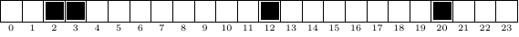

Les filtres de Bloom
====================

Les tables de hachage sont utiles dans bien des cas. Si le nombre de
clés à stocker est très grand (comme, par exemple dans la cas d'une base
de données) alors la taille de la table est telle qu'il est nécessaire
de la stocker sur le disque. L'inconvénient à cela est que les temps
d'accès deviennent alors bien plus importants que lorsque la table est
stockée en mémoire. Si on doit de nombreuses fois tester l'existence
d'un élément dans la table cela peut devenir rédhibitoire.

Pour pallier ce problème, on peut ajouter une structure de données
intermédiaire qui servira d'*oracle*. L'oracle a la propriété suivante :
si un élément est présent dans la table alors il répondra oui, si il
n'est pas présent alors il répondra oui ou non. Cette structure de
données a pour but de limiter les requêtes inutiles : pour tester la
présence d'un élément dans la table on interroge l'oracle avant
d'interroger la table. Bien sûr, l'objectif est de concevoir un oracle
qui réponde rarement oui lorsque l'élément n'est pas dans la table.

Le type d'oracle que nous allons implanter est lui-même une table de
hachage : il s'agit des **filtres de Bloom**. L'idée est la suivante. On
crée une table $B$ de booléens. On dispose pour les clés que nous avons
à ranger d'un certain nombre $m$ de fonctions de hachage
$h_i, 0 \leq i \leq m-1$. Pour chaque clé $k$ à ajouter à $B$, au lieu
de se contenter de mettre à vrai la case $B(h(k))$ comme on le ferait
classiquement, on va mettre à vrai les $m$ cases $B(h_i(k))$. Le
principe étant que la probabilité que deux clés différentes aient les
mêmes $m$ valeurs pour leurs fonctions de hachage est faible.

Par exemple, supposons que nous souhaitions entrer la clé "timoleon"
dans la table $B$ de taille 24, que nous ayons quatre fonctions de
hachage et que $h_0("timoleon") = 2$, $h_1("timoleon") = 12$,
$h_2("timoleon") = 3$, $h_3("timoleon") = 20$. L'état de la table $B$
après l'insertion sera :

Pour savoir si une clé est présente, on s'assurera que les $m$ cases de
la table $B$ correspondant aux valeurs des $m$ fonctions de hachage sont
positionnées à vrai.

Le but du TP est d'implémenter un filtre de Bloom et de tester
l'efficacité de celui-ci en faisant varier sa taille ainsi que le nombre
de fonctions de hachage. Pour mesurer l'efficacité on estimera le taux
de faux positifs, c'est-à-dire le ratio entre le nombre de fois où le
filtre se trompe et le nombre de clés interrogées.

1.  Récupérez les sources.

        git fetch upstream
        git merge upstream/master

    Vous trouverez un module `bloomfilter` où vous implanterez les
    primitives de manipulation d'un filtre de Bloom, et un programme
    `test.py`. Un programme gnuplot `tp-bloom.plt` est également fourni pour
    tracer les courbes.

Fonctions de hachage d'une chaîne de caractères
-----------------------------------------------

Nous allons supposer que nous manipulons des clés qui sont des chaînes
de caractères écrites avec les 128 premiers caratères de la table ASCII.

Afin d'obtenir différentes fonctions de hachage, nous allons attribuer
un code différent aux caractères pour chaque fonction de hachage. Le
code d'un caractère sera obtenu de manière aléatoire. A cette fin on a
créé un tableau `random_tab` contenant tous ces codes (voir
la figure).

Ce tableau peut être initialisé grâce à la fonction
`init_random_tab` (voir le fichier test.py). N'oubliez pas
d'appeler une **et une seule** fois cette fonction dans vos tests, sinon
vous aurez des résultats curieux.

1.  Écrire le corps de la fonction `code_of_string` qui,
    étant donnée une chaîne `s` et un numéro
    `n` calcule la somme des valeurs des codes des
    caractères. Le code calculé servira à la $n$ -ième fonction de
    hachage pour la chaîne `s`. Cette fonction n'est pas à
    proprement parlé la fonction de hachage puisqu'on n'est pas assuré
    que le code renvoyé soit compris entre 0 et la taille de la table
    (qu'on ne connaît pas encore).

Le module bloomfilter
---------------------

Ce module va implanter un filtre de Bloom qui associe un booléen à une
clé. Il contient trois primitives :

La fonction `create` prend ainsi en second paramètre la
fonction qui fournit le code associé à une clé insérée dans le filtre.
Un exemple d'appel à cette fonction est :

    create(4,code_of_string,nb_hash_functions)

1.  Écrire le code des trois fonctions du module
    `Bloomfilter`.
2.  Tester vos fonctions en utilisant le programme de test déjà écrit
    qui insère le mot "timoleon" puis teste sa présence dans le filtre
    et la présence d'un mot aléatoire.
3.  Trouver une taille du filtre pour laquelle un mot tiré au hasard
    apparaît présent, ce qui veut dire qu'on a un faux positif.

L'analyse des faux-positifs
---------------------------

Maintenant que vous disposez d'un filtre de Bloom fonctionnel, vous
allez pouvoir tester l'influence du nombre de fonctions de hachage et de
la taille du filtre sur le nombre de faux positifs.

Pour réaliser ces tests nous allons faire varier : - le nombre de
fonctions de hachage de 1 à 8 - la taille du filtre de $2^{10}$ à
$2^{20}$

Pour chaque jeu de test, nous allons construire un filtre de Bloom et y
insérer $2^{10}$ mots tirés au hasard. Une fois ces mots insérés, on
tirera au hasard $2^{14}$ mots de tests dont on testera la présence. Il
ne faudra pas oublier de s'assurer que les mots de test ne sont pas dans
le jeu de mots insérés initialement. Le pseudo-code est donc :

    creer l'ensemble des mots à inserer I
    pour n = 1 à 8 faire
      pour t = 10 à 20 faire
        creer un filtre de bloom BF de taille 2^t à n fonctions de hacahge
        inserer les mots de I dans BF
        pour k = 1 to 2^14 faire
          tirer un mot au hasard U
          si U n'appartient pas à I alors
            augmenter le compteur de mots testés
            si U appartient à BF alors
              augmenter le compteur de faux positifs 
            fin si
          fin si
        fin pour
        imprimer dans cet ordre:
           la taille du filtre, le nombre de fonctions, le nombre de mots testes, 
           le nombre de faux positifs, le taux de faux positifs
      fin pour
      imprimer deux lignes vides
    fin pour

1.  Ecrire une procédure test correspondant à l'algorithme donné
    ci-dessus. Afin de s'assurer de la compatibilité avec les fichiers
    distribués pour ce TP, vous respecterez l'ordre dans lequel les
    boucles sont faites et l'ordre dans lequel les impressions sont
    effectuées.

    Vous devriez avoir un résultat similaire à : :

        10 1 16383 10537 0.643167
        11 1 16385 6584 0.401831
        12 1 16385 3663 0.223558
        13 1 16385 1866 0.113885
        14 1 16385 1035 0.063168
        15 1 16385 529 0.032286
        16 1 16385 267 0.016295
        17 1 16385 174 0.010619
        18 1 16385 164 0.010009
        19 1 16385 164 0.010009
        20 1 16385 159 0.009704

        10 2 16385 12562 0.766677
        11 2 16385 6634 0.404883
        ...

2.  Enregistrer vos résultats dans un fichier nommé
    `res.txt`.
3.  Utiliser le programme Gnuplot `tp-bloom.plt` pour
    tracer la courbe des résultats obtenus. :

        gnuplot < tp-bloom.plt

4.  Commenter.

