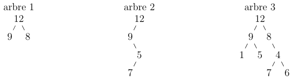

Manipulation des arbres binaires
================================

L'objectif de ce TP est d'utiliser un module de création d'arbres
binaires (que vous avez écrit ou que vous écrirez lors du cours de PdC)
afin d'implanter les fonctions usuelles de manipulation des arbres
binaires puis des arbres binaires de recherche. Le dernier travail
consiste en l'implantation d'un petit jeu utilisant un arbre binaire de
recherche pour sa résolution.

Pour rappel voici les fonctions dont vous disposez dans le module d'arbres:

    -   création d'un arbre
    -   ajouter/modifier un fils à gauche ou à droite en étant sur un
        nœud ou feuille
    -   descendre à gauche, descendre à droite
    -   obtenir la valeur associée à un nœud

Dans l'archive vous trouverez dans un répertoire `src-c` : le module
ArbresBinaire et un programme `Test_arbre.c` avec les entêtes des
fonctions à écrire et le code pour des tests.

Pour les étudiants en mathématiques (et pour eux-seuls) vous
trouverez dans un répertoire `src` le module tree et un programme
`test.py` vous permettant de réaliser le TP en Python.

Vérification des arbres produits
--------------------------------

### Réalisation en C

Le module *ArbreBinaire* permet de manipuler des arbres binaires. Afin
de vérifier que les arbres produits sont ceux auxquels vous vous
attendez, nous fournissons également une primitive qui prend un arbre,
le transforme en un fichier au format "gv" qui permet la visualisation
de l'arbre grâce au programme "dot".

Vous observerez attentivement la documentation dans *ArbreBinaire.h*
pour comprendre le fonctionnement des primitives.

Par exemple, le fichier `exemple1_arbre.c` contient la construction d'un
arbre puis produit le fichier "gv" de cet arbre. Pour construire cet
arbre et le visualiser, il suffit d'exécuter les commandes suivantes :

    make exemple1_arbre.exec
    ./exemple1_arbre.exec # produit exemple1.gv
    make exemple1.pdf # produit exemple1.pdf si exemple1.gv existe

Vous pouvez alors visualiser le pdf produit avec l’outil de votre choix.

Pour compiler le programme de test `Test_arbre.c` il suffira d'exécuter
`make Test_arbre.exec`
et on pourra lancer ce programme grâce à
`./Test_arbre.exec`

### Réalisation en Python

Le module *tree* fournit les primitives pour manipuler les arbres
binaires. Afin de vérifier que les arbres produits sont ceux auxquels
vous vous attendez, nous fournissons également une primitive qui prend
un arbre, le transforme en un fichier au format "gv" qui permet la
visualisation de l'arbre grâce au programme "dot".

Par exemple, le fichier exemple.py contient la construction d'un arbre
puis produit le fichier "gv" de cet arbre. Pour construire cet arbre et
le visualiser, il suffit d'exécuter les commandes suivantes :

    python3 exemple.py
    dot -Tpdf -oexemple.pdf exemple.gv

Arbres binaires
---------------

Nous nous intéressons ici aux arbres binaires dans leur généralité. Dans
une seconde partie nous nous concentrerons sur les arbres binaires de
recherche.

### Création d'arbres

1.  Écrire le code des trois fonctions `arbre1`,
    `arbre2` et `arbre3` qui créent les arbres
    des figures ci-dessous.
    
    

### Impression

1.  Écrire le code de la fonction `imprimer` qui écrit les
    valeurs d'un arbre binaire de manière infixée. Testez sur les trois
    arbres exemples.

### Décomptes sur les arbres

1.  Écrire le code de la fonction `nbFeuilles` qui calcule
    le nombre de feuilles d'un arbre donné en paramètre.
2.  Écrire le code de la fonction `taille` qui compte le
    nombre total de nœuds (nœuds internes et feuilles) d'un arbre.
3.  Écrire le code de la fonction `hauteur` qui calcule la
    hauteur d'un arbre donné en paramètre (on rappelle que notre
    convention est qu'un arbre vide est de hauteur -1).
4.  Etant donné une taille $n$ fixée, il est possible de construire des
    arbres binaires dont la topologie est différente. Le nombre de
    ces topologies différentes est donné par la récurrence :

    $$c\_0 &= 1 \\ [c](){n+1} &= s[um](){k=0}\^nc\_kcdot [c](){n-k}$$

    Programmez la fonction `nbArbres` avec un algorithme
    récursif s'appuyant sur ces équations de récurrence.

5.  Calculez les valeurs de $c_n$ pour $n$ compris entre 0 et 19. Que
    constatez-vous pour le calcul des dernières valeurs ?
6.  Programmez une seconde version de la fonction
    `nbArbres` nommée `nbArbresEfficace` avec
    un algorithme itératif utilisant un tableau pour stocker les valeurs
    des nombres $c_k$ avec $k \leq n$.
7.  À l'aide de cette seconde version, calculez à nouveau les valeurs de
    $c_n$ pour n compris entre 0 et 19. Constatez l'amélioration des
    temps de calcul.

Arbres binaires de recherche
----------------------------

Nous considérons manipuler désormais des **arbres binaires de
recherche**. Nous vous rappelons leur propriété qui est que chaque nœud
$x$ de l'arbre binaire a une valeur telle que toutes les valeurs des
nœuds du sous-arbre gauche de $x$ sont inférieures ou égales à la valeur
du nœud $x$ et toutes les valeurs du sous-arbre droit de $x$ sont
strictement supérieures à la valeur du nœud $x$.

1.  Écrire une fonction `abr1` permettant la création d'un
    arbre binaire de recherche dans lequel les valeurs sont insérées
    successivement en suivant l'ordre donné :

        arbre 1: 6, 4, 2, 7, 5, 1

2.  Comment s'assurer (simplement) que les arbres construits sont bien
    des arbres binaires de recherche ?
3.  Écrire une fonction `ajouter` qui ajoute une valeur à
    un arbre binaire.
4.  Écrire les fonctions `abr2` et `abr3`
    permettant la création des arbres binaires de recherche en utilisant
    la fonction `ajouter` dans lesquels les valeurs sont
    insérées successivement en suivant l'ordre donné :

        arbre 2: 5, 4, 2, 7, 6, 1
        arbre 3: 7, 1, 4, 5, 6, 2

5.  Écrire un prédicat `appartient` qui teste si une valeur
    est présente dans l'arbre.
6.  Modifier cette fonction pour compter le nombre de comparaisons
    effectuées. Sur lequel des trois arbres donnés en exemple y a-t-il
    le moins de comparaisons pour la recherche de 0 ? Pourquoi ?
7.  Où se trouvent respectivement l'élément minimal et maximal d'un
    arbre binaire de recherche ? Écrire les deux fonctions qui
    retournent ces valeurs.

L'entier mystérieux
-------------------

Le jeu de l'*entier mystérieux* n'est pas un jeu très intelligent. Il se
joue à deux joueurs : le premier choisit un entier compris entre 1 et
$n$, et le second doit deviner cet entier en posant des questions du
style "5 ?", la réponse pouvant être "gagné", "trop petit" ou "trop
grand".

La meilleure stratégie pour minimiser le nombre de questions à poser est
évidemment de procéder par dichotomie : on commence par tester
$\frac{n}{2}$. Si l'énigme à trouver est inférieure à $\frac{n}{2}$, on
teste $\frac{n}{4}$, etc. Cette dichotomie peut être représentée par un
ABR contenant tous les entiers de 1 à $n$ : la racine de l'ABR contient
le premier coup à jouer, puis suivant la réponse ("plus petit", "plus
grand"), on joue la racine du fils gauche ou celle du fils droit. Et
ainsi de suite. Le nombre de coups à jouer avant de gagner est la
profondeur du nœud de valeur celle de l'énigme dans cet ABR.

1.  Écrire la fonction récursive
    `contruireArbreEntierMysterieux` qui construit l'ABR du
    jeu contenant les entiers de $i$ à $j$, les deux paramètres de la
    fonction.
2.  Écrire la procédure `jouer` qui permet de faire jouer
    l'ordinateur à l'*entier mystérieux* en utilisant un ABR : vous
    choisissez un nombre et vous le faites deviner à l'ordinateur (sans
    tricher, bien sûr).

